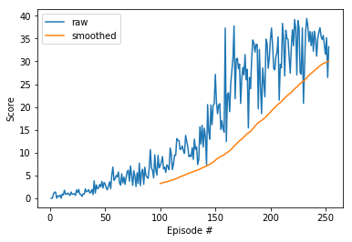

# report of the model and its performance

## architecture
The agent is trained with Deep Deterministic Policy Gradient (DDPG) algorithm,
where the policy is given by a neural network ("Actor" network)
as an action with maximum value for the state,
train another neural network ("Critic" network) for the state-value function
with the obtained action and the next state,
and the Actor network is trained using an advantage.
Here, the advantage is calculated as the temporal difference
as follows:

(reward) + gamma * V(next state) - V(current state),

where gamma is a discount factor (0.99 in this repository),
and V is the state-value function.
Because the Actor is trained to output the optimal action,
this algorithm is suitable for problems with continuous action space.

### neural network architecture
Both of the Actor and the Critic networks have the almost same structure
of a fully-connected neural networks
with two hidden layers, where the number of each unit is 256.
The number of output units in the Actor network is 4,
corresponding to the best values for the given state.
The Critic networks has only a single unit as an output,
which is for the state-value function.
The difference of structure of these two networks is that action values are given
as additional units in the first hidden layer of the Critic network.

### soft update
In training, two networks with exactly the same structure are prepared
for both Actor and Critic.
They are called "local" and "target" networks,
where outputs of the target network are used to calculate the loss value of the network.
Though weights for the local network is updated in a usual way,
those for the target network are not.
A weight update of the target network is done as follows:

(new weight for the target) = tau * (weight for the local) + (1-tau) * (weight for the target),

where tau is an interpolation parameter and usually is close to 0.
In this repository, tau=0.001.
This way of weight updates is helpful to stabilize the learning.

## implementation
Codes for learning and model architecture are taken from [ddpg-pendulum](https://github.com/udacity/deep-reinforcement-learning/tree/master/ddpg-pendulum)
and modified for this project.
Several parameters are tuned (learning rate, noise size,
and the number of units of the hidden layers in the Actor and Critic networks).
In addition, update of network weights is not done
every time a new experience is added to the replay buffer,
but 10 times every 20 new experience.

## performance
Here is an example of learning history of the agent.
The training continued until an average score of 100 consecutive episode reches 30.
This goal was achieved with 254 episodes with 35 minutes in this example,
though fluctuation of performance is large
and thus it sometimes takes much longer to achieve the goal
or it sometimes even fails.

## possible future improvement
The problem of this implementation is instability of learning process
and it takes long to complete training.
Although a single agent environment is chosen,
improved version of DDPG alghrothim,
namely [Distributed Distributional DDPG (D4PG)](https://arxiv.org/pdf/1804.08617v1.pdf),
is available with another environment option with 20 agents.
In this algorithm, the Q function is regarded as expectation value of some distribution Z,
which is approximated with multiple agents.
There are also some modification like weight update with N-step TD estimates
and priotization of the experience replay.
This techniques may help effective learning and speed up of the training process.

